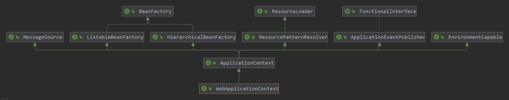
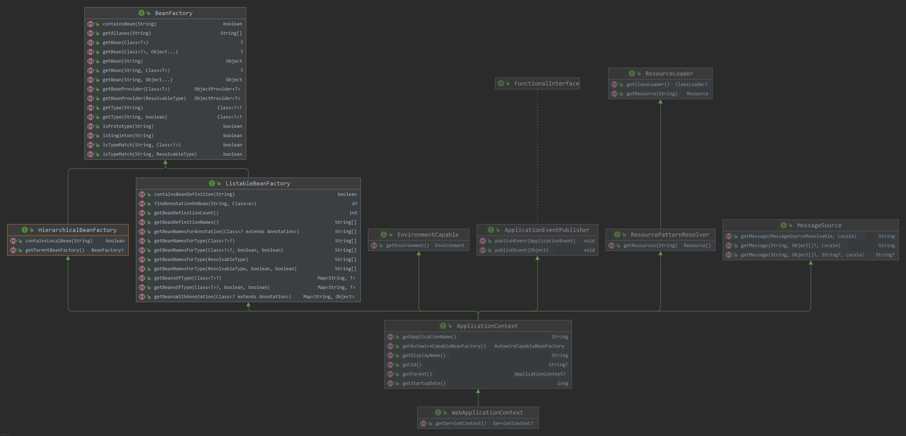

# Spring IOC

## IOC容器相关解释  

定义：别名 依赖倒置原理（Dependency Inversion Principle) ,使用了倒置注入，使得依赖对象的获取被反转了。也就是依赖于注入，也叫控制反转。依赖关系可以通过依赖注入或者IOC容器来完成。把控制权从具体对象手中交出来，可以方便代码解耦。同时提高可测试性。
IOC只是实现控制反转的载体，它可以在初始化的时候或生成直接把数据注入到对象，也可以通过将对象引用注入到对象数据域中的方式来实现。IOC容器充当了一个调控系统的应用平台，对象之间的依赖关系，由IOC容器进行管理，并由IOC容器完成对象的注入。
## Spring IOC容器  

Spring IOC是控制反转模式的一种实现。Spring IOC提供了一个基本的Java Bean容器，通过IOC模式，管理对象间的依赖关系。
并通过依赖注入和AOP切面增强为JavaBean这样的POJO对象赋予事务管理，生命周期管理等基本功能。具体的实现中有接口注入、setter注入、构造器注入是主要的注入方式。使用Spring时setter注入是常见的注入方式，而且为了防止注入异常，Spring Ioc容器还提供了对特定依赖的检查。Spring 设计IOC容器的实现，也适用了很多应用场景，比如：带有不同容器特性，读取不同配置信息的，从不同I/O源读取配置信息的，面向注解的。可以更好的满足对IOC容器的各种使用需求。  
我们经常接触到的BeanFactory和ApplicationContext都可以看成是容器的具体表现形式，如果深入去看，实际上代表着一系列功能各异的容器产品，只是容器功能有大有小，有各自的特点。Spring提供各种各样的选择，供开发人员根据需要选择。  
BeanFactory是这个容器最基本的功能描述，在此基础上，Spring通过定义BeanDefinition来管理基于Spring的应用中各种对象以及它们之间的依赖关系。BeanDefinition抽象了我们对于对象的定义，BeanDefinition就是对依赖反转模式中管理对象依赖关系的抽象，也是容器实现依赖反转功能的核心数据结构，依赖反转都是围绕BeanDefinition来实现的。  
## Spring IOC的设计  
主要是为了把原来对象-对象的关系，解耦为 对象-IOC容器-对象的关系，体现出IOC容器对应用的平台作用。
Spring Ioc容器设计中，主要是两个，一个是BeanFactory接口的简单容器系列，这个系列实现了基本的功能，另一个是ApplicationContext应用上下文，它作为高级容器，基本上满足了对容器的大部分要求了。  
  
带方法
  
### 区分FactoryBean和BeanFactory
BeanFactory是IOC容器是一个对象工厂，管理所有Bean的  
FactoryBean 是一个能产生或者修饰对象的工厂Bean,它的实现与设计模式工厂模式和修饰器模块类似。也就是对象工厂  

